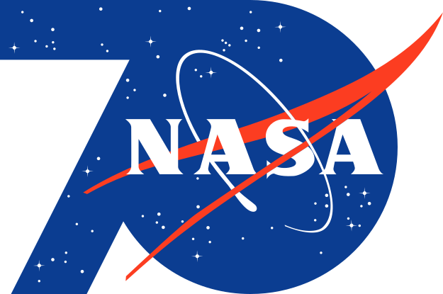

SUPSI 2026  
Corso d’interaction design, CV429.01  
Docenti: A. Gysin, G. Profeta  

Progetto 1: La conquista dello spazio

# NASA 70
Autore: Luca Mazzola \
[NASA 70](https://lucamazzolaa.github.io/NASA70/)


## Introduzione e tema
Realizzato in occasione del 70º anniversario della NASA nel 2028, il progetto propone una piattaforma web che raccoglie e presenta una serie di esperienze interattive dedicate alla conquista dello spazio. La pagina introduce il tema celebrativo dell’iniziativa e offre l’accesso ai tredici progetti sviluppati dagli studenti a partire da dati, immagini e documenti provenienti dagli archivi pubblici della NASA. Allo stesso tempo, la struttura della piattaforma è pensata per accogliere e organizzare nel tempo anche centinaia di nuovi progetti e contenuti, configurandosi come un archivio in continua espansione.

L’obiettivo è valorizzare il patrimonio informativo e culturale dell’agenzia aerospaziale attraverso forme contemporanee di visualizzazione e narrazione digitale, offrendo agli utenti la possibilità di esplorare prospettive diverse sul tema dell’esplorazione spaziale. Oltre a fungere da archivio e punto di accesso ai contenuti, la piattaforma ospita il logo NASA 70, elemento centrale dell'identità visiva sviluppata per il settantesimo anniversario della NASA.


## Riferimenti progettuali


Le principali fonti di ispirazione per il progetto derivano da una raccolta di immagini, interfacce e riferimenti visivi analizzati durante la fase di ricerca. In particolare è emersa la ricorrenza di immagini grandangolari, viste panoramiche e forme circolari che richiamano pianeti, superfici planetarie, finestrini delle navicelle spaziali, visiere dei caschi degli astronauti e il logo stesso della NASA. Questi elementi contribuiscono a trasmettere un senso di vastità, osservazione e immersione, caratteristiche che hanno influenzato in modo significativo la progettazione della homepage del sito.


## Design dell’interfaccia e modalità di interazione
L’interfaccia del progetto è organizzata secondo una struttura chiara e minimale, pensata per bilanciare esplorazione immersiva e consultazione ordinata dei contenuti. Tutte le pagine condividono una stessa identità visiva basata su una palette cromatica coerente e sull’utilizzo uniforme della tipografia, così da garantire continuità e riconoscibilità durante la navigazione. È stato inoltre scelto uno sfondo grigio molto chiaro anziché completamente bianco, una soluzione che permette di distinguere meglio le numerose immagini con sfondo bianco presenti nei contenuti ed evita che queste si fondano visivamente con la pagina.

### Pagine del sito
| N. | File | Pagina | Contenuto |
| :--- | :--- | :--- | :--- |
| 1 | **`index.html`** | NASA 70 | Interfaccia esplorativa immersiva |
| 2 | **`projects.html`** | Projects | Archivio dei progetti consultabile in formato lista con filtri e ricerca |
| 3 | **`about.html`** | About | Sezione informativa dedicata al contesto del progetto |

### Menu globale fisso


Il menu superiore costituisce l’elemento di navigazione principale e presenta il nome del progetto sulla sinistra, il logo dedicato al 70º anniversario della NASA al centro, riprendendo la posizione occupata dal marchio nel sito ufficiale dell’agenzia, e le pagine Projects e About sulla destra, garantendo un accesso immediato alle diverse aree della piattaforma.


### Logo


Il progetto mantiene il logo storico della NASA come elemento centrale dell’identità visiva, preservandone la riconoscibilità istituzionale e il valore simbolico. Al logo si affianca un 7 geometrico, ispirato al concept del logo realizzato per il 40º anniversario, scelto come riferimento per la sua capacità di sintetizzare celebrazione e chiarezza formale. Questa soluzione permette di costruire un segno grafico coerente con il 70º anniversario, mantenendo un equilibrio tra tradizione e reinterpretazione contemporanea.
Nella mia interpretazione progettuale, il logo celebrativo sostituisce temporaneamente il marchio NASA all'interno del sito ufficiale per tutta la durata delle celebrazioni del 70º anniversario.


### 1. NASA 70 (index.html)


La Homepage si distingue per un approccio immersivo e non convenzionale. Invece di una struttura statica, l’utente si trova di fronte a un’unica immagine di copertina che diventa spazio di esplorazione. Attraverso lo scroll o il trascinamento, è possibile navigare all’interno di questa superficie visiva continua, scoprendo progressivamente i diversi progetti senza uscire dalla dimensione principale. L’unica azione di uscita dall’esperienza è la selezione di un elemento, che conduce direttamente alla pagina del progetto scelto.

### 2. Projects (projects.html)


La sezione Projects adotta invece una struttura più tradizionale e funzionale, organizzata come una lista di contenuti consultabili. Questa area permette una navigazione più analitica dei progetti, supportata da strumenti di ricerca, ordinamento e filtraggio che facilitano l’esplorazione dei dati in base a categorie e criteri specifici.

### 3. About (about.html)


La sezione About è concepita come uno spazio esclusivamente tipografico, dedicato alla spiegazione dell’iniziativa e delle sue finalità. Qui vengono presentati il contesto del progetto e le informazioni necessarie per comprenderne la struttura e le modalità di funzionamento, offrendo una lettura chiara e diretta dell’intero sistema.


## Tecnologia usata
Il progetto poggia su una solida architettura front-end nativa, sviluppata in **HTML5, CSS3 e JavaScript (ES6)**. HTML definisce la struttura semantica dell’interfaccia, mentre CSS ne gestisce l'estetica attraverso un design system responsivo basato su variabili, calcoli fluidi e tipografia personalizzata. JavaScript funge da motore logico dell’applicazione: orchestra il DOM, gestisce gli eventi dell’utente e sincronizza l’interfaccia con i dati e le librerie esterne.<br>

Di seguito vengono presentati tre estratti di codice chiave tratti dal file **`index.html`**, che rappresenta la pagina più complessa e tecnicamente articolata del progetto. In questa sezione si concentra infatti la maggior parte della logica interattiva, con la gestione dell’esperienza esplorativa principale, delle animazioni e dei meccanismi di navigazione che regolano l’accesso alle altre parti del sistema.

### Rendering avanzato e Shader distorsivi (Three.js e GLSL)
Per ottenere l’effetto di profondità e curvatura della griglia visiva, si è optato per l’utilizzo di materiali basati su shader personalizzati (`ShaderMaterial`). Il codice GLSL iniettato a livello di vertice calcola la distanza dal centro dello schermo e altera la posizione sull’asse Z, creando una deformazione a lente parabolica che viene calcolata direttamente dalla GPU.

**HTML**
```html
<div id="viewport">
    <div id="canvas"></div>
</div>
```

**CSS**
```css
#viewport { 
    position: fixed
    top: 0
    left: 0
    width: 100vw
    height: 100vh
    z-index: 1
    overflow: hidden
}

#canvas { 
    position: absolute
    top: 0
    left: 0
    width: 100%
    height: 100%
}
```

**JavaScript**
```javascript
const s = String.fromCharCode(59)

const vertexShader = `
    varying vec2 vUv ${s}
    void main() {
        vUv = uv ${s}
        vec4 mvPosition = modelViewMatrix * vec4(position, 1.0) ${s}
        
        float dist = length(mvPosition.xy) ${s}
        mvPosition.z += dist * dist * 0.015 ${s} 
        
        gl_Position = projectionMatrix * mvPosition ${s}
    }
`

// Assegnazione del materiale custom ai piani della griglia
const material = new THREE.ShaderMaterial({
    uniforms: {
        tDiffuse: { value: currentData.tex },
        uPickingColor: { value: new THREE.Color(imageId) },
        uIsPicking: { value: 0.0 }
    },
    vertexShader: vertexShader,
    fragmentShader: fragmentShader,
    side: THREE.DoubleSide
})
```


### Fetch dati e Texturing dinamico (API e CanvasTexture)
L’architettura carica i riferimenti progettuali in modo asincrono da un endpoint JSON esterno. Parallelamente, per visualizzare la tipografia all'interno dello spazio 3D, un nastro di testo scorrevole viene disegnato dinamicamente su un elemento nativo HTML Canvas e convertito in una `CanvasTexture` continua, applicata poi come rivestimento ai modelli geometrici.

**HTML**
```html
<script>
    const fontRoman = new FontFace('HelveticaFallback', 'url("assets/helvetica/HelveticaLTStd-Roman.otf")', { weight: '400' })
    const fontMedium = new FontFace('HelveticaFallback', 'url("assets/helvetica/HelveticaLTStd-Roman.otf")', { weight: '500' })
    const fontBold = new FontFace('HelveticaFallback', 'url("assets/helvetica/HelveticaLTStd-Bold.otf")', { weight: '600' })

    fontRoman.load().then(f => document.fonts.add(f)).catch(e => console.warn("Font 400 locale assente"))
    // [...]
</script>

<script type="module">
    import * as THREE from 'https://cdn.skypack.dev/three@0.136.0'
    // [...] Modulo principale dell'applicazione
</script>
```

**JavaScript**
```javascript
fetch('https://ixd-supsi.github.io/n70api/data.json')
    .then(res => res.json())
    .then(data => {
        let projects = []
        data.forEach(p => {
            // [...] Logica di parsing ed estrazione immagini omessa per brevità
            projects.push({ 
                file: imgFilename, 
                url: p.url || '#'
            })
        })
        initThree(projects)
    })

// Generazione texture tipografica dinamica
const textCanvas = document.createElement('canvas')
textCanvas.width = textWidth
textCanvas.height = 128
const ctx = textCanvas.getContext('2d')
ctx.font = '40px "Helvetica", "HelveticaFallback", sans-serif'
ctx.fillStyle = '#888888' 
ctx.fillText(textStr, 0, 64)

const textTexture = new THREE.CanvasTexture(textCanvas)
textTexture.wrapS = THREE.RepeatWrapping
textTexture.wrapT = THREE.RepeatWrapping
```


### Griglia infinita e interazione Pixel-Perfect (WebGLRenderTarget)
La navigazione fluida e sconfinata è ottenuta matematicamente riposizionando gli elementi che escono dal campo visivo sul lato opposto della scena durante il ciclo di rendering (`requestAnimationFrame`). Per gestire l'interazione del cursore si è implementato un sistema di "Color Picking": la scena viene fotografata fuori schermo assegnando un colore univoco a ciascun elemento per identificare l'oggetto puntato analizzando le coordinate del pixel selezionato.

**HTML**
```html
<header>
    <div class="header-left">
        <span class="site-title hover-target" onclick="window.location.href='index.html'">NASA 70</span>
    </div>
    <div class="logo-container">
        
    </div>
    <nav>
        <a href="projects.html" class="hover-target">Projects</a>
        <a href="about.html" class="hover-target">About</a>
    </nav>
</header>
```

**CSS**
```css
header { 
    position: fixed
    top: 0
    left: 0
    width: 100%
    padding: 20px 20px 20px 20px
    display: grid
    grid-template-columns: 1fr auto 1fr
    align-items: center
    z-index: 10000
    background: #000000
    pointer-events: auto
}

nav a { 
    text-decoration: none
    color: #ffffff !important
    font-size: 16px
    font-weight: 500
    transition: color 0.3s var(--ease)
    cursor: pointer
}
```

**JavaScript**
```javascript
function getHoveredObject(clientX, clientY) {
    planes.forEach(p => {
        if (p.material.uniforms.uIsPicking) {
            p.material.uniforms.uIsPicking.value = 1.0
        }
    })
    
    camera.setViewOffset(window.innerWidth, window.innerHeight, clientX, clientY, 1, 1)
    
    renderer.setRenderTarget(pickingTexture)
    renderer.clear()
    renderer.render(scene, camera)
    
    camera.clearViewOffset()
    renderer.readRenderTargetPixels(pickingTexture, 0, 0, 1, 1, pixelBuffer)
    renderer.setRenderTarget(null)
    
    // [...] Ripristino shader omesso per brevità
    
    const id = (pixelBuffer[0] << 16) | (pixelBuffer[1] << 8) | pixelBuffer[2]
    return planes.find(p => p.userData.id === id)
}

function animate() {
    requestAnimationFrame(animate)

    scrollX += (targetScrollX - scrollX) * 0.05
    scrollY += (targetScrollY - scrollY) * 0.05

    group.position.x = scrollX
    group.position.y = scrollY

    // Logica spaziale di riposizionamento continuo
    planes.forEach(plane => {
        const globalX = plane.position.x + scrollX
        const globalY = plane.position.y + scrollY

        if (globalX > limitX) plane.position.x -= totalWidth
        if (globalX < -limitX) plane.position.x += totalWidth

        if (globalY > limitY) plane.position.y -= totalHeight
        if (globalY < -limitY) plane.position.y += totalHeight
    })

    renderer.render(scene, camera)
}
```


## Target e contesto d’uso
Il progetto è rivolto a un pubblico generalista internazionale, proveniente da diverse aree geografiche del mondo, interessato allo spazio, alla divulgazione scientifica e alle modalità contemporanee di visualizzazione dei dati. L’interfaccia è pensata per essere accessibile a utenti di età eterogenea, indicativamente da adolescenti e studenti fino a un pubblico adulto, senza richiedere competenze tecniche o scientifiche specifiche.

Il contesto ideale di fruizione è quello digitale e quotidiano, attraverso dispositivi personali come computer, tablet o smartphone, ma anche in ambienti educativi e culturali come scuole, università e spazi espositivi legati alla scienza e alla ricerca. Il progetto si presta inoltre a una fruizione autonoma e internazionale, favorendo un’esplorazione libera e immersiva dei contenuti da parte di utenti con background e livelli di esperienza differenti.
